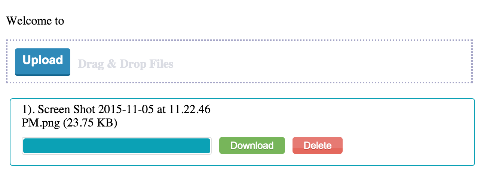

# uploadify = express && koa 2 uploadify with jquery fileupload

[](https://gitter.im/i5ting/uploadify?utm_source=badge&utm_medium=badge&utm_campaign=pr-badge&utm_content=badge)
[](https://www.npmjs.com/package/uploadify)
[](https://travis-ci.org/i5ting/uploadify)
[](https://codecov.io/github/i5ting/uploadify?branch=koa)
[](http://standardjs.com/)



Artwork by [i5ting](http://www.github.com/i5ting/).


- [科普：express文件上传、上传到七牛](upload.md)

## Install

express version(on master branch)

    $ [sudo] npm install --save uploadify

koa 2 version(on koa branch)

    $ [sudo] npm install --save koa-uploadify

## Code

### server

```
var mount_uploadify = require('uploadify')

mount_uploadify(app,{
  path:'/fileupload',
  fileKey:'myfile',
  multer:{ dest: 'uploads/' },
  callback:function(req){
    console.log(111);
    return req.files
  }
});
```

- 情景一：上传，不需要回调
- 情景二：上传后处理，上面的配置里，必须有callback，根据req里的内容，完成对应的请求即可

新增

- debug=true可以调试
- qn（如果配置了qn，就只能上传一张图，并把上传结果合并到req.files里）


```
mount_uploadify(app,{
  debug: false,
  qn: simditor_qn_config.qn,
  path: '/fileupload',
  fileKey: 'myfile',
  multer: simditor_qn_config.multer,
  callback: function(req){
      console.log(req);
  }
});
```

注意写法

```
$("#fileuploader").uploadFile({
	url:"/fileupload/",
	fileName:"myfile",
  multiple:true,
  dragDrop:true,
  showDownload:true,
  showDelete: true,
  onSuccess: function (files, response, xhr, pd) {
    alert(JSON.stringify(response[0].url.split('/').pop()));
  },
  statusBarWidth:300,
  dragdropWidth:300,
  deleteCallback: function (data, pd) {
      for (var i = 0; i < data.length; i++) {
        alert(data);
          $.post("delete.php", {op: "delete",name: data[i]},
              function (resp,textStatus, jqXHR) {
                  //Show Message	
                  alert("File Deleted");
              });
      }
      pd.statusbar.hide(); //You choice.

  },
  downloadCallback:function(filename,pd)
  	{
  		location.href="download.php?filename="+filename;
  	}
});
```

比如http://img.mengxiaoban.cn/FuHkI0z4A5uHk5DtkmdoMhqEiUEt

response[0].url.split('/').pop() == FuHkI0z4A5uHk5DtkmdoMhqEiUEt 

和自己绑定的域名拼接到一起就可以了

如果想定制预览之类的效果，可以在`onSuccess`里处理
        
### resource

copy css && js to some folder

```
jquery-upload-file/
```

### use in jade

```
extends layout

block content
  h1= title
  p Welcome to #{title}

  #fileuploader Upload
    
  script.
    $(document).ready(function() {
    	$("#fileuploader").uploadFile({
    		url:"/fileupload/",
    		fileName:"myfile",
        multiple:true,
        dragDrop:true,
        showDownload:true,
        showDelete: true,
        onSuccess: function (files, response, xhr, pd) {
          alert(JSON.stringify(files));
        },
        statusBarWidth:600,
        dragdropWidth:600,
        deleteCallback: function (data, pd) {
            for (var i = 0; i < data.length; i++) {
              alert(data);
                $.post("delete.php", {op: "delete",name: data[i]},
                    function (resp,textStatus, jqXHR) {
                        //Show Message	
                        alert("File Deleted");
                    });
            }
            pd.statusbar.hide(); //You choice.

        },
        downloadCallback:function(filename,pd)
        	{
        		location.href="download.php?filename="+filename;
        	}
    	});
    });
```

more info see http://hayageek.com/docs/jquery-upload-file.php

## Contributing

1. Fork it
2. Create your feature branch (`git checkout -b my-new-feature`)
3. Commit your changes (`git commit -am 'Add some feature'`)
4. Push to the branch (`git push origin my-new-feature`)
5. Create new Pull Request

## 版本历史

- v1.0.0 初始化版本

## 欢迎fork和反馈

- write by `i5ting` i5ting@126.com

如有建议或意见，请在issue提问或邮件

## License

this repo is released under the [MIT
License](http://www.opensource.org/licenses/MIT).
